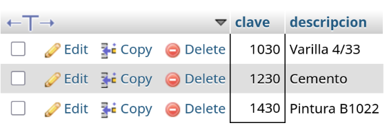

# Laboratorio 20

### Los materiales (clave y descripción) entregados al proyecto "México sin ti no estamos completos".

```
SELECT M.clave, M.descripcion
FROM materiales M, entregan E, proyectos P
WHERE E.clave = M.clave
AND E.numero = P.numero
AND P.denominacion = 'México sin ti no estamos completos';
```

> [!NOTE]
> Número de filas: 3




### Los materiales (clave y descripción) que han sido proporcionados por el proveedor "Acme tools".

```

```

> [!NOTE]
> Número de filas:


### El RFC de los proveedores que durante el 2000 entregaron en promedio cuando menos 300 materiales.

```

```

> [!NOTE]
> Número de filas:


### El Total entregado por cada material en el año 2000.

```

```

> [!NOTE]
> Número de filas:


### La Clave del material más vendido durante el 2001. (se recomienda usar una vista intermedia para su solución)

```

```

> [!NOTE]
> Número de filas:


### Productos que contienen el patrón 'ub' en su nombre.

```

```

> [!NOTE]
> Número de filas:


### Denominación y suma del total a pagar para todos los proyectos.

```

```

> [!NOTE]
> Número de filas:


### Denominación, RFC y RazonSocial de los proveedores que se suministran materiales al proyecto Televisa en acción que no se encuentran apoyando al proyecto Educando en Coahuila (Solo usando vistas).

```

```

> [!NOTE]
> Número de filas:


### Denominación, RFC y RazonSocial de los proveedores que se suministran materiales al proyecto Televisa en acción que no se encuentran apoyando al proyecto Educando en Coahuila (Sin usar vistas, utiliza not in, in o exists).

```

```

> [!NOTE]
> Número de filas:


### Costo de los materiales y los Materiales que son entregados al proyecto Televisa en acción cuyos proveedores también suministran materiales al proyecto Educando en Coahuila.

```

```

> [!NOTE]
> Número de filas:


