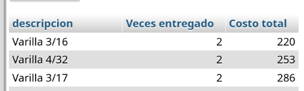

# Laboratorio 20

### Consulta de un tabla completa 

```
select * from materiales 
```

> [!NOTE]
> Número de filas: 45


### Selección 

```
select * from materiales
where clave=1000
```

> [!NOTE]
> Número de filas: 1


### Proyección 

```
select clave,rfc,fecha from entregan 
```

> [!NOTE]
> Número de filas: 87


### Reunión Natural 

```
select * from materiales,entregan
where materiales.clave = entregan.clave
```

> [!NOTE]
> Número de filas: 87


### Reunión con criterio específico 

```
select * from entregan,proyectos
where entregan.numero <= proyectos.numero 
```

> [!NOTE]
> Número de filas: 836


### Unión

```
(select * from entregan where clave=1450)
union
(select * from entregan where clave=1300)
```

> [!NOTE]
> Número de filas: 2


### Intersección

```
(select clave from entregan where numero=5001)
intersect
(select clave from entregan where numero=5018) 
```

> [!NOTE]
> Número de filas: 1


### Diferencia

```
(select * from entregan)
except
(select * from entregan where clave=1000) 
```

> [!NOTE]
> Número de filas: 85


### Producto cartesiano

```
select * from entregan,materiales 
```

> [!NOTE]
> Número de filas: 3915


### Operadores de cadena

```
SELECT * FROM materiales where Descripcion LIKE 'Si%' 
```

> [!NOTE]
> Número de filas: 2


### Between

```
SELECT Clave,RFC,Numero,Fecha,Cantidad
FROM entregan
WHERE Numero Between 5000 and 5010; 
```

> [!NOTE]
> Número de filas: 43


### Exists

```
SELECT RFC,Cantidad, Fecha,Numero
FROM entregan
WHERE Numero Between 5000 and 5010 AND
Exists ( SELECT RFC
FROM proveedores
WHERE RazonSocial LIKE 'La%' and entregan.RFC = proveedores.RFC )
```

> [!NOTE]
> Número de filas: 12


---

### Los materiales (clave y descripción) entregados al proyecto "México sin ti no estamos completos".

```
SELECT M.clave, M.descripcion
FROM materiales M, entregan E, proyectos P
WHERE E.clave = M.clave
AND E.numero = P.numero
AND P.denominacion = 'México sin ti no estamos completos';
```

> [!NOTE]
> Número de filas: 3


### Los materiales (clave y descripción) que han sido proporcionados por el proveedor "Acme tools".

```
SELECT M.clave, M.descripcion
FROM materiales M, entregan E, proveedores P
WHERE E.clave = M.clave
AND E.rfc = P.rfc
AND P.razonsocial = 'Acme tools';
```

> [!NOTE]
> Número de filas: 0


### El RFC de los proveedores que durante el 2000 entregaron en promedio cuando menos 300 materiales.

```
SELECT P.rfc, AVG(E.cantidad) AS 'Promedio Materiales'
FROM proveedores P, entregan E
WHERE E.rfc = P.rfc
AND E.fecha BETWEEN '2000-01-01' AND '2000-12-31'
GROUP by P.rfc
HAVING AVG(E.cantidad) >= 300;
```

> [!NOTE]
> Número de filas: 3


### El Total entregado por cada material en el año 2000.

```
SELECT M.descripcion, SUM(E.cantidad) AS 'Total entregado'
FROM materiales M, entregan E
WHERE E.clave = M.clave
AND E.fecha BETWEEN '2000-01-01' AND '2000-12-31'
GROUP by M.clave;
```

> [!NOTE]
> Número de filas: 11


### La Clave del material más vendido durante el 2001. (se recomienda usar una vista intermedia para su solución)

```
SELECT M.clave
FROM materiales M, entregan E
WHERE M.clave = E.clave
AND E.fecha BETWEEN '2000-01-01' AND '2000-12-31'
GROUP BY M.clave
HAVING SUM(E.cantidad) = (SELECT MAX(total)
                            FROM (SELECT SUM(E2.cantidad) AS total
                                    FROM materiales M2, entregan E2
                                    WHERE M2.clave = E2.clave
                                    AND E2.fecha BETWEEN '2000-01-01' AND '2000-12-31'
                                    GROUP BY M2.clave) as totales);
```

> [!NOTE]
> Número de filas: 1


### Productos que contienen el patrón 'ub' en su nombre.

```
SELECT m.descripcion
FROM materiales m
WHERE m.descripcion LIKE "%ub%";
```

> [!NOTE]
> Número de filas: 12


### Denominación y suma del total a pagar para todos los proyectos.

```
SELECT p.denominacion, SUM((e.cantidad*(m.precio+m.impuesto))) as 'TotalMaterial'
FROM proyectos p, entregan e, materiales m
WHERE p.numero = e.numero
AND m.clave = e.clave
GROUP BY p.numero
```

> [!NOTE]
> Número de filas: 20


### Denominación, RFC y RazonSocial de los proveedores que se suministran materiales al proyecto Televisa en acción que no se encuentran apoyando al proyecto Educando en Coahuila (Solo usando vistas).

```
SELECT DISTINCT pr.denominacion, p.rfc, p.razonsocial
FROM entregan e, proyectos pr, (SELECT p.razonsocial, p.rfc
                                FROM proveedores p, entregan e, proyectos pr
                                WHERE p.rfc = e.rfc
                                AND pr.numero = e.numero
                                AND pr.denominacion = "Televisa en acción"
                                EXCEPT (SELECT p.razonsocial, p.rfc
                                        FROM proveedores p, entregan e, proyectos pr
                                        WHERE p.rfc = e.rfc
                                        AND pr.numero = e.numero
                                        AND pr.denominacion = "Educando en Coahuila")) p
WHERE p.rfc = e.rfc
AND pr.numero = e.numero 
```

> [!NOTE]
> Número de filas: 16


### Denominación, RFC y RazonSocial de los proveedores que se suministran materiales al proyecto Televisa en acción que no se encuentran apoyando al proyecto Educando en Coahuila (Sin usar vistas, utiliza not in, in o exists).

```
SELECT DISTINCT pr.denominacion, p.rfc, p.razonsocial
FROM proveedores p, entregan e, proyectos pr
WHERE p.rfc = e.rfc
AND pr.numero = e.numero
AND p.rfc IN (SELECT p.rfc
                FROM proveedores p, entregan e, proyectos pr
                WHERE p.rfc = e.rfc
                AND pr.numero = e.numero
                AND pr.denominacion = "Televisa en acción"
                AND p.rfc NOT IN (SELECT p.rfc
                                 FROM proveedores p, entregan e, proyectos pr
                                 WHERE p.rfc = e.rfc
                                 AND pr.numero = e.numero
                                 AND pr.denominacion = "Educando en Coahuila"));
```

> [!NOTE]
> Número de filas: 16


### Costo de los materiales y los Materiales que son entregados al proyecto Televisa en acción cuyos proveedores también suministran materiales al proyecto Educando en Coahuila.

```
SELECT DISTINCT m.descripcion, m.precio
FROM proveedores p, entregan e, proyectos pr, materiales m
WHERE p.rfc = e.rfc
AND pr.numero = e.numero
AND m.clave = e.clave
AND e.rfc IN (SELECT p.rfc
                FROM proveedores p, entregan e, proyectos pr
                WHERE p.rfc = e.rfc
                AND pr.numero = e.numero
                AND pr.denominacion = "Televisa en acción"
                AND p.rfc IN (SELECT p.rfc
                              FROM proveedores p, entregan e, proyectos pr
                              WHERE p.rfc = e.rfc
                              AND pr.numero = e.numero
                              AND pr.denominacion = "Educando en Coahuila"));
```

> [!NOTE]
> Número de filas: 11


### Nombre del material, cantidad de veces entregados y total del costo de dichas entregas por material de todos los proyectos. 

```
SELECT m.descripcion, COUNT(*) as 'Veces entregado', SUM(m.precio + m.impuesto) as 'Costo total'
FROM materiales m, entregan e
WHERE m.clave = e.clave
GROUP BY m.clave;
```

> [!NOTE]
> Número de filas: 44


