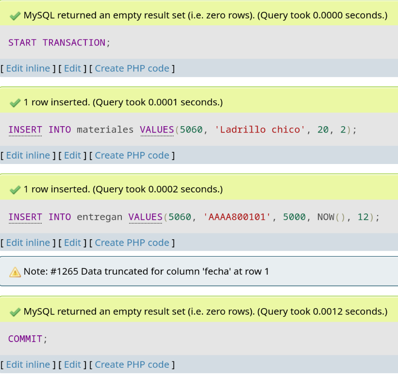
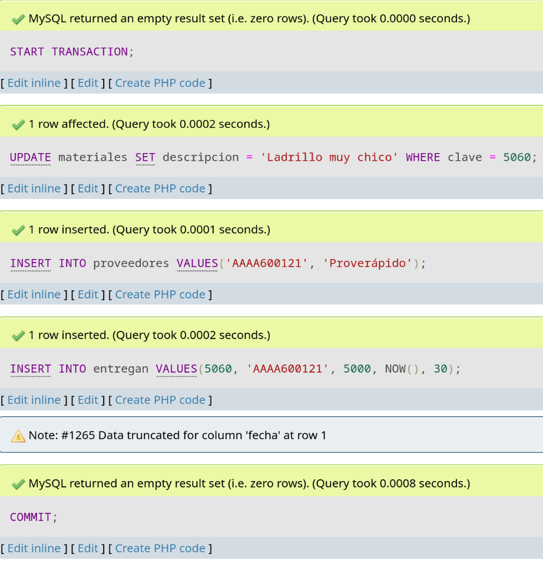

# Laboratorio 25

## Transacción 1

Creación de un nuevo material que se usa en una entrega.

```sql
START TRANSACTION;
INSERT INTO materiales VALUES(5060, 'Ladrillo chico', 20, 2);
INSERT INTO entregan VALUES(5060, 'AAAA800101', 5000, NOW(), 12);
COMMIT;
```



## Transacción 2

Cambiarle el nombre a un material ya existente, crear un nuevo proveedor y añadirlo a una entrega.

```sql
START TRANSACTION;
UPDATE materiales SET descripcion = 'Ladrillo muy chico' WHERE clave = 5060;
INSERT INTO proveedores VALUES('AAAA600121', 'Proverápido');
INSERT INTO entregan VALUES(5060, 'AAAA600121', 5000, NOW(), 30);
COMMIT;
```

